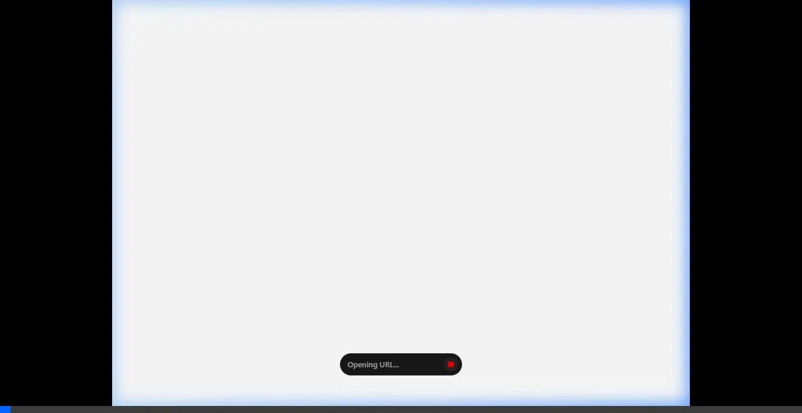
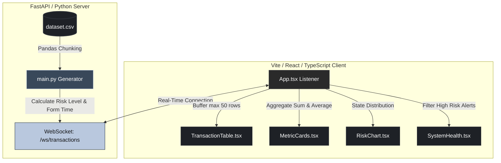

# AlphaRisk Terminal: Institutional Risk Ledger

AlphaRisk is a professional-grade, high-fidelity Real-Time Financial Risk Dashboard designed for high-stakes institutional analytics. The project simulates live streaming of financial transactions (utilizing the synthetic Paysim dataset) over WebSockets and analyzes risk metrics dynamically on a custom-tailored, premium dark UI.

---

## Live Performance Demo

Below is the recording showing the interactive UI flow and the live stream of transactions updating in real time:



---

## System Architecture

The following diagram illustrates how transaction data is streamed, processed, and visualized across the stack:



---

## Features

<details>
<summary><b>Real-Time WebSocket Ingest</b> (Click to expand)</summary>

Transactions are read sequentially in chunks from the database and pushed directly to clients with sub-second latencies over `/ws/transactions`, avoiding any standard database querying or HTTP polling overhead.
</details>

<details>
<summary><b>Dynamic Institutional Metrics</b> (Click to expand)</summary>

Aggregates total volumes and rolling risk indexes dynamically inside React states on every incoming packet. The active risk score updates instantly using a weighted risk level sum.
</details>

<details>
<summary><b>Premium Matte Aesthetics</b> (Click to expand)</summary>

A dark, high-density dashboard prioritizing technical data density. Custom slate panels are separated by 1px borders to limit eye strain during long-term monitoring, adhering to corporate minimalism.
</details>

<details>
<summary><b>Auto-Responding Security Alerts</b> (Click to expand)</summary>

Intercepts critical fraud flags or abnormally high amounts and automatically registers them in the system log with high-priority warnings.
</details>

---

## Interface Micro-Animations & Interactivity

The user interface implements intentional micro-animations to highlight events without cluttering the screen:

- **Connection Heartbeat**: The status dot in the header pulsates green when the WebSocket connection is active, and switches to a red alert warning state if the server disconnects.
- **Row Interaction Flash**: Clicking any row in the transaction table flashes the item with a subtle blue/charcoal background tint, fading out over 300ms.
- **Progress Transitions**: The risk distribution bars slide dynamically as percentages shift in response to the transaction stream.
- **Auto-Scroll Stream**: The ledger rows dynamically animate and scroll downwards as new messages arrive.

---

## Tech Stack

* **Backend**: Python 3.10+, FastAPI, Pandas, Uvicorn, Websockets.
* **Frontend**: React 19, TypeScript, Vite, Tailwind CSS v4, PostCSS, Google Material Symbols.

---

## Repository Structure

```
Financial Risk Detector/
├── dataset.csv                 # 493 MB transaction dataset (Paysim schema)
├── backend/
│   ├── main.py                 # FastAPI application with WebSockets & Pandas streaming
│   └── requirements.txt        # Backend dependencies
└── frontend/
    ├── tailwind.config.js      # Custom theme configurations (slates, deep charcoals)
    ├── postcss.config.js       # PostCSS compiler configuration
    ├── index.html              # Core font (Inter) & icon CDN links
    └── src/
        ├── App.tsx             # Main client manager & WebSocket connection handler
        ├── types.ts            # Transaction, alert, and metric TypeScript interfaces
        ├── index.css           # Global custom scrollbars and base themes
        └── components/
            ├── Sidebar.tsx     # Terminal logo and navigation tabs
            ├── Header.tsx      # Connected health indicator ("Nominal") & profile controls
            ├── MetricCard.tsx  # Bento summary stats card
            ├── TransactionTable.tsx # Live update transaction ledger
            ├── RiskChart.tsx   # Live updating risk distribution bars
            └── SystemHealth.tsx # Warning alerts tracker
```

---

## Quick Start Instructions

<details>
<summary><b>1. Configure the Backend (FastAPI)</b></summary>

Navigate to the backend directory and launch the server:
```bash
cd backend
python -m venv venv
source venv/bin/activate       # On Linux/macOS
# OR
.\venv\Scripts\activate        # On Windows

pip install -r requirements.txt
uvicorn main:app --port 8000 --reload
```
The FastAPI documentation will be available at `http://127.0.0.1:8000/docs`, and the WebSocket will listen at `ws://127.0.0.1:8000/ws/transactions`.
</details>

<details>
<summary><b>2. Configure the Frontend (Vite + React)</b></summary>

In a separate terminal shell, navigate to the frontend folder, install dependencies, and run Vite:
```bash
cd frontend
npm install
npm run dev
```
Open your browser to `http://localhost:5173/`. The dashboard will automatically connect to the active stream, and the terminal ledger will start populating with real-time rows.
</details>
