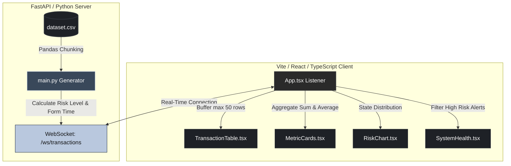

# AlphaRisk Terminal: Institutional Risk Ledger

AlphaRisk is a professional-grade, high-fidelity **Real-Time Financial Risk Dashboard** scaffolding designed for high-stakes institutional analytics. The project simulates live streaming of financial transactions (utilizing the synthetic Paysim dataset) over WebSockets and analyzes risk metrics dynamically on a custom-tailword, premium dark UI.

---

## 🛠️ System Architecture

The following diagram illustrates how transaction data is streamed, processed, and visualized across the stack:



---

## ✨ Features

- 🔄 **Live WebSocket Stream**: Transaction events are read sequentially in chunks from `dataset.csv` and pushed directly to clients with sub-second latencies.
- 📊 **Dynamic Analytics Engine**: Aggregates total transaction volumes and active risk indexes on-the-fly inside React states.
- ⚡ **Bento Grid layout**: Dark, high-density layout prioritizing technical information, clear visual structure, and zero clutter.
- 🛡️ **Rule-Based Risk Classification**: Automatically labels incoming payments, cash-outs, and transfers based on size, flag conditions, and origin metrics.
- ⚠️ **System Health Logging**: Automatically intercepts critical, high-risk flags and registers them in the system log.
- 🖱️ **Micro-Interactions**: Row hover visual states and temporary background flash triggers on clicks mimic institutional Bloomberg/Reuters terminal behavior.

---

## 💻 Tech Stack

* **Backend**: Python 3.10+, FastAPI, Pandas, Uvicorn, Websockets.
* **Frontend**: React 19, TypeScript, Vite, Tailwind CSS v4, PostCSS, Google Material Symbols.

---

## 📁 Repository Structure

```
Financial Risk Detector/
├── dataset.csv                 # 493 MB transaction dataset (Paysim schema)
├── backend/
│   ├── main.py                 # FastAPI application with WebSockets & Pandas streaming
│   └── requirements.txt        # Backend dependencies
└── frontend/
    ├── tailwind.config.js      # Custom theme configurations (slates, deep charcoals)
    ├── postcss.config.js       # PostCSS compiler configuration
    ├── index.html              # Core font (Inter) & icon CDN links
    └── src/
        ├── App.tsx             # Main client manager & WebSocket connection handler
        ├── types.ts            # Transaction, alert, and metric TypeScript interfaces
        ├── index.css           # Global custom scrollbars and base themes
        └── components/
            ├── Sidebar.tsx     # Terminal logo and navigation tabs
            ├── Header.tsx      # Connected health indicator ("Nominal") & profile controls
            ├── MetricCard.tsx  # Bento summary stats card
            ├── TransactionTable.tsx # Live update transaction ledger
            ├── RiskChart.tsx   # Live updating risk distribution bars
            └── SystemHealth.tsx # Warning alerts tracker
```

---

## 🚀 Quick Start Instructions

Follow these simple steps to run the full-stack system locally:

### 1. Configure the Backend (FastAPI)
Navigate to the backend directory and launch the server:
```bash
cd backend
python -m venv venv
source venv/bin/activate       # On Linux/macOS
# OR
.\venv\Scripts\activate        # On Windows

pip install -r requirements.txt
uvicorn main:app --port 8000 --reload
```
The FastAPI documentation will be available at `http://127.0.0.1:8000/docs`, and the WebSocket will listen at `ws://127.0.0.1:8000/ws/transactions`.

### 2. Configure the Frontend (Vite + React)
In a separate terminal shell, navigate to the frontend folder, install dependencies, and run Vite:
```bash
cd frontend
npm install
npm run dev
```
Open your browser to `http://localhost:5173/`. The dashboard will automatically connect to the active stream, and the terminal ledger will start populating with real-time rows.
